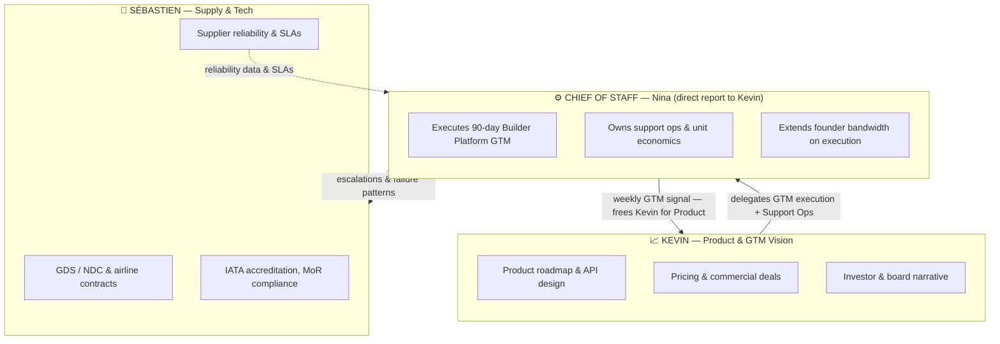
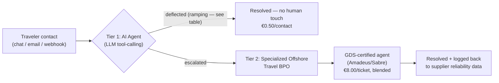

# Jinko — Chief of Staff 90-Day Plan & Support Model
**Prepared for:** Kevin, Head of Product & GTM (direct debrief) — cc Sébastien, Co-Founder Supply/Tech
**Prepared by:** Nina Tabaka, Candidate — Chief of Staff
**Date:** September 8, 2026 · v3 — revised after founder review

> 📌 **How to read this document:** Part 0 is the operating model — how the Chief of Staff role extends founder bandwidth. Part 1 is the 90-day GTM plan I'd run starting Day 1, built on where Jinko's Builder Platform relationships actually stand today — signed, warm, and cold. Part 2 is the support model that scales *alongside* Part 1: hands-on and manual for the first 50–100 bookings while the team builds the real playbook, then handed to a hybrid AI + BPO system once the actual failure modes are understood.

---

## Part 0: Executive Summary & Founder Alignment

**The Chief of Staff role exists to extend founder bandwidth, not resolve founder friction.** Sébastien has confirmed that founder decision-making at Jinko is already collegial and the Supply/Product swimlanes are well-coordinated — this plan isn't fixing a coordination problem that doesn't exist. As Jinko scales, the CoS role extends founder bandwidth, institutionalizing operational execution across GTM and Support Ops so Kevin remains focused on core Product strategy. The CoS takes full day-to-day ownership of GTM execution and support ops as a dedicated operating swimlane — an operational force multiplier, freeing founder time for what only founders can do: product vision, supply partnerships, and the investor/board narrative.

### Reporting Line & Org Positioning

The CoS is a **direct report to Kevin** and a lateral execution engine for his GTM vision — not a layer above either founder, and not a mechanism for adjudicating between them. Kevin delegates GTM execution and Support Ops so he can stay focused on Product; Sébastien remains a peer swimlane, exchanging supply data and escalations directly with the CoS without needing Kevin in the loop for every handoff.



### Strategic Alignment

> **🛡️ For Sébastien — supplier reliability is the product, not a side concern.**
> Every claim we make to Builder Platforms ("deterministic, 500ms, no captchas") is only true if supply holds. The support model in Part 2 protects this directly: escalations route supplier-caused failures (cancellations, hotel no-shows) back to you as structured data instead of anecdotes, and the sensitivity audit treats hotel margin as the single highest-impact variable in the whole model — because that's exactly where supply quality and mix show up in the P&L. You get signal, not tickets.

> **🚀 Aligning with Kevin's GTM vision — executing a sharp, concentrated bet on Builder Platforms via MCP.**
> The GTM plan spends 80% of energy on this segment and explicitly excludes Enterprise/Mid-Market RFPs, which are too slow and too founder-time-intensive for this window. The North Star Metric is a production commitment, not a vanity metric like signups or stars — it's the number that proves willingness to pay, not willingness to try.

---

## Part 1: 90-Day Go-To-Market Strategy

### Partner Segmentation: Where Jinko Actually Stands Today

The 90-day plan is built on the *real* state of each relationship, not a flat list of logos — treating a signed partner like a cold lead (or a warm one like a stranger) wastes the exact founder bandwidth this role exists to protect.

| Tier | Platform | Status | 90-Day Job |
|---|---|---|---|
| 🟢 **Signed** | Exa | Already a signed partner | Operationalize into production — convert the signature into real, measured GMV |
| 🟡 **Warm** | Lovable | Active relationship — Jinko already co-hosted a hackathon with them | Convert warmth into a deeper technical integration + joint co-marketing, not cold outreach |
| ⚪ **Cold** | Replit, Vercel AI, Bolt.new + 2–3 second-tier | Net-new, no prior contact | Cold outreach motion (Asset 1) — builds the pipeline behind Exa and Lovable |

### Focus: Builder Platforms via MCP (80% of energy allocation)

We are not selling to individual developers. We are selling to the **platforms developers already build on** — and the 90-day job is different for each tier above. **Expected sales cycle: 2–4 months** per platform, first contact to production — which is exactly why Exa and Lovable, both already ahead of that clock, anchor the Day-90 North Star, while the cold motion targets Month 4+ conversions. The remaining 20% of energy goes to opportunistic inbound and existing pipeline maintenance.

### Strategic Moat: Native API vs. "Browser-Use" Failure Modes

| Failure Mode | Browser-Use Scrapers | Jinko Native API |
|---|---|---|
| **CAPTCHAs / bot walls** | Breaks the agent mid-task, unrecoverable without human intervention | Never encountered — direct API, no browser |
| **Token overhead** | 15,000–50,000+ tokens per booking flow (full DOM/screenshot context) | ~500 tokens per call — structured JSON in/out |
| **Latency** | 30–90+ seconds per flow, highly variable | <450ms, deterministic |
| **PNR / ticketing capability** | **None.** Cannot issue a real, GDS-backed PNR | Native IATA ticketing, direct GDS connections, real PNR generation |
| **Payment & liability** | No Merchant of Record — agent builder inherits chargeback/compliance risk | Jinko is MoR — liability sits with us, not the builder |
| **Reliability under UI change** | Breaks silently whenever the target site redesigns | Versioned API contract — breaking changes are opt-in |

This table *is* the pitch to a Builder Platform's DevRel/BD lead: they are currently shipping demos that cannot actually book anything real. We let them ship a feature that works.

### North Star & Secondary Metrics

> **🎯 North Star (Day 90): Exa (signed) live in production running Jinko as its default travel integration, plus Lovable (warm) advanced to technical beta/trial — collectively driving >€150,000 in GMV (generating >€10,000 in net Jinko revenue).** In parallel, cold outreach to 5–8 net-new platforms builds the pipeline for Q2.

Exa and Lovable anchor the North Star because they're already ahead of a fresh 2–4 month sales cycle — a cold-started relationship realistically can't clear "production" by Day 90, so the honest target leans on the relationships that already exist. GMV and net revenue are reported separately on purpose: GMV (traveler-facing transaction value) proves real usage; net revenue (Jinko's take) is what actually funds the business.

> **📊 Secondary Metric: Hotel booking mix ≥ 35% of total bookings.** Hotels carry a materially higher net take rate than flights (see Part 2), so the *composition* of the €150k GMV matters as much as the total.

### 90-Day Execution Timeline

| Month | Theme | Key Actions | Exit Criteria |
|---|---|---|---|
| **Month 1** (Wk 1–4) | **Activate & Land** | Ship `jinko.com/mcp`. Kick off Exa's production integration workplan. Re-engage Lovable off the hackathon with a co-marketing + deeper-integration proposal. Launch cold outreach (Asset 1) to 5–8 net-new platforms (e.g., Replit, Vercel AI, Bolt.new). | Landing page live, Exa integration workplan kicked off, Lovable proposal sent, 3+ cold discovery calls booked |
| **Month 2** (Wk 5–8) | **Convert & Seed** | Push Exa toward real production traffic. Convert Lovable's proposal into a signed technical trial. Launch a developer bounty program (€500–2,000 per shipped integration) targeting the cold pipeline's communities. | Exa processing real production bookings, Lovable in technical trial, ≥5 community-built apps live from the bounty |
| **Month 3** (Wk 9–12) | **Production Deploy** | Formalize Exa as a default, production, GMV-generating integration. Support Lovable through its technical trial toward production readiness. Keep 2–3 cold prospects advancing toward technical trial for Q2. Close the North Star Metric. | Exa live in production + Lovable in technical beta/trial, >€150k combined GMV (>€10k net revenue), ≥35% hotel mix |

### Anti-Goals (What We WILL NOT Do)

- **Zero direct Enterprise/Mid-Market RFPs.** Different buyer, different sales cycle (often 9–18 months) — responding to even one RFP this window would eat founder time that belongs in Builder Platform conversations.
- **No cold-templating Exa or Lovable.** They get direct, relationship-specific outreach from Kevin/the CoS — not the cold sequence built for net-new platforms.
- **No paid acquisition** (ads, sponsorships beyond the bounty program) before Month 2.
- **No per-platform API customization.** One SDK, one MCP server. Platform-specific wrappers are the platform's job, not ours.

### Pivot Triggers

| Signal (by end of…) | Trigger |
|---|---|
| Month 1 | Zero discovery calls booked from the **cold motion** after 25–30 contacts across multiple net-new platforms → rework the offer/asset, not the target list (Exa/Lovable are unaffected — different motion entirely) |
| Month 2 | **Exa's production integration stalls with no clear technical blocker** → escalate to Kevin immediately; a signed partner not converting to GMV is a red flag, not a normal sales-cycle delay |
| Month 2 | Fewer than 3 community apps shipped from the bounty program → the friction is technical, not incentive-based; pause new bounties and fix onboarding/docs first |
| Month 3 | On track for **<€75k combined GMV** → extend Month 3 by 30 days rather than move goalposts |
| Any month | Hotel mix trending <25% with no correction path → escalate to **both Kevin** (agent prompt/UX may be steering travelers toward flights over hotels) **and Sébastien** (supply-side hotel inventory/pricing) — a joint product-and-supply problem, not a single-owner fix |

---

### 📧 Embedded Shipped Asset 1: Cold Outreach Email

> **Target:** Head of DevRel / Head of BD at a **net-new, cold-tier platform** (e.g., Replit, Vercel AI, Bolt.new) — **not** Lovable (warm relationship, gets a direct proposal instead) or Exa (already signed).
> **Channel:** Email (LinkedIn as backup, 48h later if no reply)
> **Goal:** Book a 20-minute technical discovery call to scope a joint MCP integration + developer bounty program
> **Signature note:** signed with a GTM-facing title, not "Chief of Staff" — a DevRel counterpart replies to a peer in developer partnerships, not a corporate title.

```
Subject: Your users' AI agents can't actually book a flight — we fixed that

Hi {{First Name}},

Quick one — I've been building demos on {{Platform}} and noticed something:
every "AI travel agent" template I've seen (yours included) either fakes the
booking step or hands off to a browser-automation scraper that breaks on
captchas and can't issue a real ticket.

We built Jinko to fix exactly that gap. It's a native travel API + MCP
server that gives any AI agent real execution — deterministic search,
booking, and payment, with actual IATA ticketing, direct GDS connections,
and real PNR generation. No browser, no captchas, no token bloat:

  - <450ms response time (vs. 30-90s for browser-use scrapers)
  - ~500 tokens per call (vs. 15-50k for DOM-based automation)
  - We're the Merchant of Record — your users' agents can transact without
    you inheriting payment/compliance liability

Two-line setup with the Vercel AI SDK / Claude Desktop / any MCP client:

  npx @jinko/mcp-server

I'd like to propose two things for {{Platform}}:
  1. A joint MCP integration — Jinko wired in as the default travel tool
     in your relevant templates, with $500 in free sandbox credit for
     your team to build and test against.
  2. A co-branded developer bounty (€500-2,000 per shipped integration)
     to seed real, working travel apps in your community.

Worth 20 minutes this week or next to scope it out?

Best,
Nina Tabaka
GTM & Developer Partnerships, Jinko
{{calendar link}}
```

---

## Part 2: Traveler Support Model

**The constraint:** in-house, always-on European travel support is not viable on €10–15 flight commissions alone at scale — but scale isn't the Day 1 problem. The sequencing below is the actual plan: prove the failure modes by hand first, then build the system that handles them at volume.

### Phase 0: Manual Support (Bookings 1–100)

For the first 50–100 bookings, support is handled manually by the CoS/team — every contact, every edge case, logged by hand. This isn't a stopgap; it's how the Protocol Matrix and the deflection/BPO assumptions below get validated instead of guessed. Real traveler contacts at this stage tell us which of the 4 emergency cases actually happen, how often, and what a real resolution looks like. The hybrid model in Phase 1 launches once this data exists, not before.

### Phase 1: Hybrid AI + BPO (Bookings 100+)



- **Tier 1 — AI Deflection:** Every inbound contact hits an LLM agent first, with direct tool-calling access to booking status, PNR lookup, and rebooking APIs. Deflection follows a realistic learning curve, not a flat rate from Day 0: **35–40% at launch → 50% by Month 6 → 60%+ by Month 12.**
- **Tier 2 — Specialized Offshore Travel BPO:** Escalations route to a GDS-certified BPO, priced **per resolved ticket, not per hour.** €8.00/ticket is the blended rate for standard escalations; critical incidents carry a separate reserve (see Protocol Matrix, Scenario 2).

### Financial Capacity Table

> ⚠️ **All figures below are illustrative, invented planning variables** — see the Sensitivity Audit for what's assumed vs. tested. "Net revenue" here is Jinko's own blended take per booking (flight fee + hotel margin, at ≥35% hotel mix), assumed at **€25** — deliberately *not* the traveler-facing GMV used as the Part 1 North Star.

| | **Month 0** | **Month 6** | **Month 12** |
|---|---|---|---|
| Monthly bookings | 400 | 2,000 | 4,000 |
| Jinko net revenue (bookings × €25) | €10,000 | €50,000 | €100,000 |
| Contact rate (assumed) | 15% | 15% | 15% |
| Total contacts | 60 | 300 | 600 |
| AI deflection rate (ramping) | 35% | 50% | 60% |
| Tier 1 (AI) cost @ €0.50/contact | €30 | €150 | €300 |
| Escalated to Tier 2 BPO | 39 | 150 | 240 |
| Tier 2 (BPO) cost @ €8.00/ticket | €312 | €1,200 | €1,920 |
| **Total support cost** | **€342** | **€1,350** | **€2,220** |
| **% of net revenue** | **3.4%** | **2.7%** | **2.2%** |

Support cost starts **above** the 2.5% long-run target while the AI is still learning (Month 0, offset in practice by Phase 0's manual groundwork) and **converges below it by Month 12** as deflection improves with real volume. Critical-incident costs (Protocol Matrix Scenario 2) are budgeted separately via a monthly emergency reserve and are not included in the €8.00 blended BPO rate above.

### Explicit Invented Variables & Sensitivity Audit

| Variable | Assumed Value | Stress Test | Impact | Notes |
|---|---|---|---|---|
| **Contact rate** | 15% | Tested at 30% | 🟢 **Low impact** | Doubling to 30% doubles support cost — at Month 12, the ratio moves from **2.2% → 4.4%** of net revenue. Still well below the booking margin it protects. |
| **Hotel net margin** | €35.00/hotel booking | Sensitivity run at 20–35% mix | 🔴 **High impact** — margin health relies on hotel mix ≥ 30% | Single biggest driver of the support-cost ratio. Below ~30% hotel mix, the ratio crosses 2.5% even at Month 12 deflection — why the secondary metric targets ≥35%, a buffer above the danger floor. |
| **BPO ticket cost** | €8.00/ticket | Tested at €15.00 | 🟡 **Medium impact** | At Month 12 volume, €15/ticket raises total to €3,900 (~3.9% of net revenue). Mitigation: multi-year BPO contract with volume-based step-downs before Month 6. |
| **AI deflection cost** | €0.50/contact | Tested at €5.00 (10x) | 🟢 **Low impact** | Even at 10x, Tier 1 spend at Month 12 is only €3,000 — structurally small vs. Tier 2 BPO cost. |
| **Look-to-book efficiency limit** | 150:1 (searches per booking) | — | ⚙️ **Infrastructure cost cap, solved with UX in mind** | Bounds Jinko's own GDS/search cost exposure. Instead of rate-limiting agents (which hurts DX mid-integration), the mitigation is a **caching layer** on high-frequency search patterns — absorbing aggressive look-to-book ratios without throttling anyone. |

### Protocol Matrix — 4 Emergency Cases

| # | Scenario | Response Protocol | Tier | SLA |
|---|---|---|---|---|
| **1** | *"Never got my booking reference"* | 100% automated — Tier 1 AI webhook fetches the PNR via traveler email lookup and resends the confirmation instantly. No human touch. | Tier 1 (AI) | < 2 minutes |
| **2** | *"11pm, hotel says they have no booking for me"* | Priority routing bypasses AI triage — Tier 2 BPO calls the hotel desk directly; pushes a secondary payment or rehouses the guest via a pre-authorized emergency budget. Costs more than a standard ticket — budgeted at **€20–€25 per critical incident**, separate from the blended €8.00 BPO rate. | Tier 2 (BPO), priority queue | < 3 min acknowledgment · < 45 min resolution |
| **3** | *"Name typo on ticket, 18 hours to flight"* | Routed to a GDS-certified BPO agent who **processes the correction according to the specific airline's waiver policy** — eligibility and fees vary by carrier and fare class, not a blanket direct edit in Amadeus/Sabre. | Tier 2 (BPO), GDS-certified only | < 4 hours (well inside the 18h window, buffered for airline processing) |
| **4** | *"Flight cancelled by the airline"* | Tier 2 BPO executes automated rebooking under the operating airline's waiver policy — identifying eligible alternate flights and rebooking via API where the airline supports it, falling back to manual GDS intervention only when the waiver is ambiguous. | Tier 2 (BPO), automated-first | < 3 min acknowledgment · < 45 min resolution |

---

## Summary: What This Delivers by Day 90

1. **Exa live in production, Lovable in technical beta/trial** — the signed partnership converted into real, measured GMV, and the warm hackathon relationship converted into a deeper integration. >€150k combined GMV generating >€10k net Jinko revenue, at ≥35% hotel mix, plus a cold pipeline of 5–8 net-new platforms feeding Q2.
2. **A support model proven by hand before it's automated** — Phase 0 builds the real playbook on the first 50–100 bookings; Phase 1's hybrid AI + BPO cost converges to under 2.5% of net revenue by Month 12 as deflection ramps with real data.
3. **Founders in their lanes, by choice not by fix** — Kevin delegates GTM execution and support ops to a direct-report CoS who extends his bandwidth; Sébastien gets structured escalation data instead of ad hoc fire drills, plus joint ownership with Kevin of any signal that traces back to product/UX rather than supply. Nothing here resolves founder friction — there isn't any to resolve.
