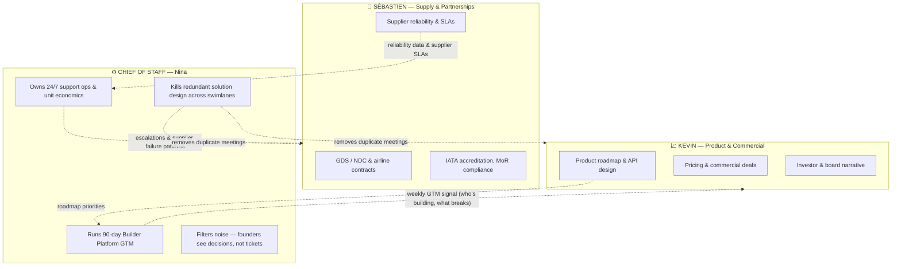
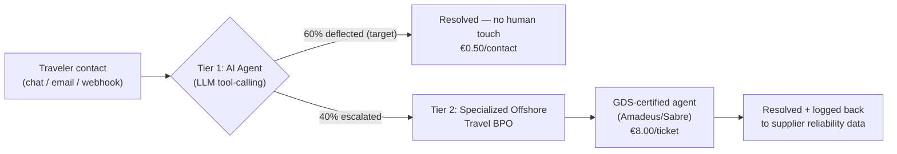

# Jinko — Chief of Staff 90-Day Plan & Support Unit Economics
**Prepared for:** Sébastien & Kevin, Co-Founders, Jinko (YC W26)
**Prepared by:** Nina Tabaka, Candidate — Chief of Staff
**Date:** September 8, 2026

> 📌 **How to read this document:** Part 0 is the operating model — how a Chief of Staff removes duplicated work between your two swimlanes. Part 1 is the 90-day GTM plan I would run starting Day 1. Part 2 is the 24/7 support and unit-economics system that has to exist *before* Part 1 succeeds — no Builder Platform goes to production on top of Jinko without a credible answer to "what happens to my user's traveler at 11pm."

---

## Part 0: Executive Summary & Founder Alignment

**The problem a Chief of Staff solves at Jinko isn't bandwidth — it's overlap.** Sébastien and Kevin have ten years of shared history and instinct for where the other will land, which is an asset until it becomes a tax: supplier conversations and commercial conversations keep re-deriving the same product tradeoffs independently. The CoS role exists to own the swimlane *between* Supply and Commercial — GTM execution and support ops — so neither founder has to context-switch into the other's territory to keep the company moving.

### Founder Focus vs. CoS Operational Leverage



### Strategic Alignment

> **🛡️ For Sébastien — supplier reliability is the product, not a side concern.**
> Every claim we make to Builder Platforms ("deterministic, 500ms, no captchas") is only true if supply holds. The support model in Part 2 protects this directly: BPO agents are GDS-certified (Amadeus/Sabre), the protocol matrix routes supplier-caused failures (cancellations, hotel no-shows) back to you as structured escalation data instead of anecdotes, and the sensitivity audit treats hotel margin as the single highest-impact variable in the whole model — because that's exactly where supply quality and mix show up in the P&L. You get signal, not tickets.

> **🚀 For Kevin — commercial traction needs a concentrated bet, not a scattered one.**
> The GTM plan spends 80% of energy on one segment (Builder Platforms via MCP) and explicitly excludes Enterprise/Mid-Market RFPs, which are too slow and too founder-time-intensive for this window. The North Star Metric is a production commitment (>€10k combined GMV, default integration status), not a vanity metric like signups or stars — it's the number you can put in front of investors that proves willingness to pay, not willingness to try.

---

## Part 1: 90-Day Go-To-Market Strategy

### Focus: Builder Platforms via MCP (80% of energy allocation)

We are not selling to individual developers. We are selling to the **platforms developers already build on** — Lovable, Replit, Vercel AI, Exa.ai (and their MCP/tool ecosystems) — so that every app built on top of them inherits Jinko as the default travel primitive. One integration, thousands of downstream apps. **Expected sales cycle: 2–4 months** per platform, from first contact to production default-integration status. The remaining 20% of energy goes to opportunistic inbound and existing pipeline maintenance — not to a second GTM motion.

### Strategic Moat: Native API vs. "Browser-Use" Failure Modes

| Failure Mode | Browser-Use Scrapers | Jinko Native API |
|---|---|---|
| **CAPTCHAs / bot walls** | Breaks the agent mid-task, unrecoverable without human intervention | Never encountered — direct API, no browser |
| **Token overhead** | 15,000–50,000+ tokens per booking flow (full DOM/screenshot context) | ~500 tokens per call — structured JSON in/out |
| **Latency** | 30–90+ seconds per flow, highly variable | <450ms, deterministic |
| **PNR / ticketing capability** | **None.** Cannot issue a real, GDS-backed PNR | Native IATA ticketing, direct GDS connections, real PNR generation |
| **Payment & liability** | No Merchant of Record — agent builder inherits chargeback/compliance risk | Jinko is MoR — liability sits with us, not the builder |
| **Reliability under UI change** | Breaks silently whenever the target site redesigns | Versioned API contract — breaking changes are opt-in |

This table *is* the pitch to a Builder Platform's DevRel/BD lead: they are currently shipping demos that cannot actually book anything real. We let them ship a feature that works.

### North Star & Secondary Metrics

> **🎯 North Star (Day 90): 2 Builder Platforms are running Jinko as their DEFAULT travel integration in production, collectively processing >€10,000 in GMV.**

"Default" means Jinko is the pre-wired tool in their MCP toolchain/template — not a link in a docs page. GMV, not API calls, because GMV proves real users completing real bookings, not just curious developers.

> **📊 Secondary Metric: Hotel booking mix ≥ 35% of total bookings.** Hotels carry a materially higher net take rate than flights (see Part 2), so the *composition* of the €10k GMV matters as much as the total — a GMV number driven mostly by flights is a weaker business than one with a healthy hotel mix.

### 90-Day Execution Timeline

| Month | Theme | Key Actions | Exit Criteria |
|---|---|---|---|
| **Month 1** (Wk 1–4) | **Target & Landing Page** | Ship `jinko.com/mcp` (Output 2, below). Rank the 5–8 highest-leverage Builder Platform contacts (Head of DevRel/BD at Lovable, Replit, Vercel AI, Exa.ai + 2–3 second-tier targets). Send the cold outreach sequence (Asset 1). Get 3+ discovery calls booked. | Landing page live, 3+ qualified calls booked, 1 platform agrees to a technical trial |
| **Month 2** (Wk 5–8) | **Hackathon & Bounties** | Co-host or sponsor a builder hackathon on the platform with the strongest early signal. Launch a developer bounty program (€500–2,000 per shipped, working integration) to get 5–10 real apps built on Jinko MCP outside our own team. Instrument every integration for GMV and hotel-mix tracking. | ≥5 community-built apps live on Jinko MCP, ≥1 platform commits to featuring Jinko in official docs/templates |
| **Month 3** (Wk 9–12) | **Production Deploy** | Convert the strongest platform relationship(s) into a formal "default integration" agreement (co-marketing, template inclusion, or direct partnership). Support the top 2–3 community apps through real production traffic. Close the North Star Metric. | 2 platforms live in production, >€10k combined GMV, ≥35% hotel mix |

### Anti-Goals (What We WILL NOT Do)

- **Zero direct Enterprise/Mid-Market RFPs.** Different buyer, different sales cycle (often 9–18 months), different swimlane — responding to even one RFP this window would eat founder time that belongs in Builder Platform conversations. Any inbound RFP gets a polite decline + "revisit in 2027" note, not a pursuit.
- **No integrations outside the top 5–8 ranked Month-1 targets.** Breadth kills a concentrated GTM motion.
- **No paid acquisition (ads, sponsorships beyond one hackathon) before Month 2.** Unpaid, high-intent developer channels first; paid spend only once we know what converts.
- **No per-platform API customization.** One SDK, one MCP server. Platform-specific wrappers are the platform's job, not ours.

### Pivot Triggers

| Signal (by end of…) | Trigger |
|---|---|
| Month 1 | Zero discovery calls booked after 8 targeted outreach sends → rework the offer/asset, not the target list |
| Month 1 | A DevRel/BD contact responds but flags "no developer demand for travel" → redirect outreach to a different vertical inside the same platform (e.g., internal-tools teams building corporate travel bots) before abandoning the platform |
| Month 2 | Fewer than 3 community apps shipped from the bounty program → the friction is technical, not incentive-based; pause new bounties and fix onboarding/docs first |
| Month 3 | On track for <€5k combined GMV → do not declare victory on "default integration" status alone; extend Month 3 by 30 days rather than move goalposts |
| Any month | Hotel mix trending <25% with no correction path → escalate to Sébastien immediately; this is a supply-side problem the CoS cannot solve alone |

---

### 📧 Embedded Shipped Asset 1: Cold Outreach Email

> **Target:** Head of DevRel / Head of BD at a Builder Platform (e.g., Lovable)
> **Channel:** Email (LinkedIn as backup, 48h later if no reply)
> **Goal:** Book a 20-minute technical discovery call to scope a joint MCP integration + developer bounty program

```
Subject: Your users' AI agents can't actually book a flight — we fixed that

Hi {{First Name}},

Quick one — I've been building demos on {{Platform}} and noticed something:
every "AI travel agent" template I've seen (yours included) either fakes the
booking step or hands off to a browser-automation scraper that breaks on
captchas and can't issue a real ticket.

We built Jinko to fix exactly that gap. It's a native travel API + MCP
server that gives any AI agent real execution — deterministic search,
booking, and payment, with actual IATA ticketing, direct GDS connections,
and real PNR generation. No browser, no captchas, no token bloat:

  - <450ms response time (vs. 30-90s for browser-use scrapers)
  - ~500 tokens per call (vs. 15-50k for DOM-based automation)
  - We're the Merchant of Record — your users' agents can transact without
    you inheriting payment/compliance liability

Two-line setup with the Vercel AI SDK / Claude Desktop / any MCP client:

  npx @jinko/mcp-server

I'd like to propose two things for {{Platform}}:
  1. A joint MCP integration — Jinko wired in as the default travel tool
     in your relevant templates, with $500 in free sandbox credit for
     your team to build and test against.
  2. A co-branded developer bounty (€500-2,000 per shipped integration)
     to seed real, working travel apps in your community — content and
     proof-of-concept for both of us, funded by us.

Worth 20 minutes this week or next to scope it out?

Best,
Nina Tabaka
Chief of Staff, Jinko
{{calendar link}}
```

---

## Part 2: 24/7 Traveler Support Model & Unit Economics

**The constraint:** in-house, always-on European travel support is not viable on €10–15 flight commissions alone. The model below is engineered to keep total support cost under **2.5% of gross revenue** at every stage of scale — the credibility layer every Builder Platform partnership needs before going to production.

### Hybrid Architecture



- **Tier 1 — AI Deflection:** Every inbound contact hits an LLM agent first, with direct tool-calling access to booking status, PNR lookup, and rebooking APIs (not a generic chatbot — it can actually take action). Target deflection: **60%**, held flat across all volume stages in the base case below (a conservative, non-optimistic assumption — any improvement in the deflection rate over time is upside, not something the model depends on).
- **Tier 2 — Specialized Offshore Travel BPO:** Escalations route to a GDS-certified BPO (Amadeus/Sabre trained agents), priced **per resolved ticket, not per hour** — so cost scales with volume, not headcount decisions.

### Financial Capacity Table

> ⚠️ **All figures below are illustrative, invented planning variables** — see the Sensitivity Audit for what's assumed vs. tested. Blended net revenue per booking (flight service fee + hotel margin blend, at the ≥35% hotel-mix target) is assumed at **€25**.

| | **Month 0** | **Month 6** | **Month 12** |
|---|---|---|---|
| Monthly bookings | 400 | 2,000 | 4,000 |
| Gross revenue (bookings × €25) | €10,000 | €50,000 | €100,000 |
| Contact rate (assumed) | 15% | 15% | 15% |
| Total contacts | 60 | 300 | 600 |
| AI deflection rate (held flat) | 60% | 60% | 60% |
| Tier 1 (AI) cost @ €0.50/contact | €30 | €150 | €300 |
| Escalated to Tier 2 BPO (40%) | 24 | 120 | 240 |
| Tier 2 (BPO) cost @ €8.00/ticket | €192 | €960 | €1,920 |
| **Total support cost** | **€222** | **€1,110** | **€2,220** |
| **% of gross revenue** | **2.2%** | **2.2%** | **2.2%** |

The ratio holds flat by construction (contact rate, deflection rate, and revenue-per-booking are all held constant) — the point isn't that it improves automatically, it's that the model is **structurally under the 2.5% ceiling at every volume stage without needing scale-driven improvement to get there.** Any gain in AI deflection rate as ticket volume trains better tool-calling coverage is pure upside on top of an already-sound base case.

### Explicit Invented Variables & Sensitivity Audit

| Variable | Assumed Value | Stress Test | Impact | Notes |
|---|---|---|---|---|
| **Contact rate** | 15% | Tested at 30% | 🟢 **Low impact** — unit economics remain structurally sound | Doubling the contact rate to 30% doubles total support cost at every volume stage, moving the ratio from **2.2% → 4.4%** of gross revenue. Still well below the booking margin it protects — the business remains profitable even in this stress case, and the fix (raise Tier 1 deflection, or renegotiate BPO rate at volume) is cheap relative to the upside. |
| **Hotel net margin** | €35.00/hotel booking | Sensitivity run at 20–35% mix | 🔴 **High impact** — margin health relies on keeping hotel mix ≥ 30% | Hotel margin is the single largest lever in blended revenue-per-booking, and therefore the single biggest driver of the support-cost ratio (since the ratio is cost ÷ revenue). Below ~30% hotel mix, blended revenue-per-booking falls enough to push the support-cost ratio above the 2.5% ceiling even at base-case contact/deflection assumptions. This is why the GTM secondary metric targets ≥35% mix — a 5-point buffer above the danger floor. |
| **BPO ticket cost** | €8.00/ticket | Tested at €15.00 | 🟡 **Medium impact** | At Month 12 volume, €15/ticket raises Tier 2 cost to €3,600 (total €3,900, ~3.9% of gross revenue) — crosses the ceiling. Mitigation: lock a multi-year BPO contract with volume-based rate step-downs before Month 6, and treat any AI deflection improvement as additional insurance against this exposure. |
| **AI deflection cost** | €0.50/contact | Tested at €5.00 (10x) | 🟢 **Low impact** | Even at 10x this cost, Tier 1 spend at Month 12 volume is only €3,000 — structurally small relative to Tier 2 BPO cost. Not a variable worth over-optimizing early. |
| **Look-to-book efficiency limit** | 150:1 (searches per completed booking) | — | ⚙️ **Infrastructure cost cap** | Bounds Jinko's own GDS/search API cost exposure, not the support model directly — but a Builder Platform whose agents search far more aggressively than 150:1 (e.g., speculative multi-agent search loops) would break this assumption and needs rate-limiting at the API layer before onboarding. Flagged here because it's a Month 2–3 GTM onboarding gate, not just a finance assumption. |

### Protocol Matrix — 4 Emergency Cases

| # | Scenario | Response Protocol | Tier | SLA |
|---|---|---|---|---|
| **1** | *"Never got my booking reference"* | 100% automated — Tier 1 AI webhook fetches the PNR via traveler email lookup and resends the confirmation instantly. No human touch. | Tier 1 (AI) | < 2 minutes |
| **2** | *"11pm, hotel says they have no booking for me"* | Priority routing bypasses AI triage — Tier 2 BPO calls the hotel desk directly; pushes a secondary payment to resolve on the spot, or rehouses the guest immediately using a pre-authorized emergency rehousing budget, reconciling with the original supplier next business day. | Tier 2 (BPO), priority queue | < 15 minutes to resolution or alternate booking confirmed |
| **3** | *"Name typo on ticket, 18 hours to flight"* | Routed to a GDS-certified BPO agent for direct correction in Amadeus/Sabre, billing the airline's correction fee where applicable (name corrections are airline-policy-specific and time-boxed — cannot be handled by generic support). | Tier 2 (BPO), GDS-certified only | < 4 hours (well inside the 18h window, buffered for airline processing) |
| **4** | *"Flight cancelled by the airline"* | Tier 2 BPO executes automated rebooking under the operating airline's waiver policy — identifying eligible alternate flights and rebooking via API where the airline supports it, falling back to manual GDS intervention only when the waiver is ambiguous or requires it. | Tier 2 (BPO), automated-first | < 30 minutes to rebooking or manual escalation |

---

## Summary: What This Delivers by Day 90

1. **Two Builder Platforms in production**, Jinko as default integration, >€10k combined GMV at ≥35% hotel mix — proof of willingness to pay, not just willingness to try, with a healthy revenue composition.
2. **A support model that survives the worst-case night**, structurally under the 2.5% cost ceiling at every volume stage — even under stress-tested assumptions — the credibility layer every Builder Platform partnership needs before going to production.
3. **Founders back in their swimlanes** — Sébastien owns supply quality with structured escalation data instead of ad hoc fire drills; Kevin owns commercial narrative with a concentrated GTM story instead of a scattered one, with zero Enterprise RFP time-sink.
