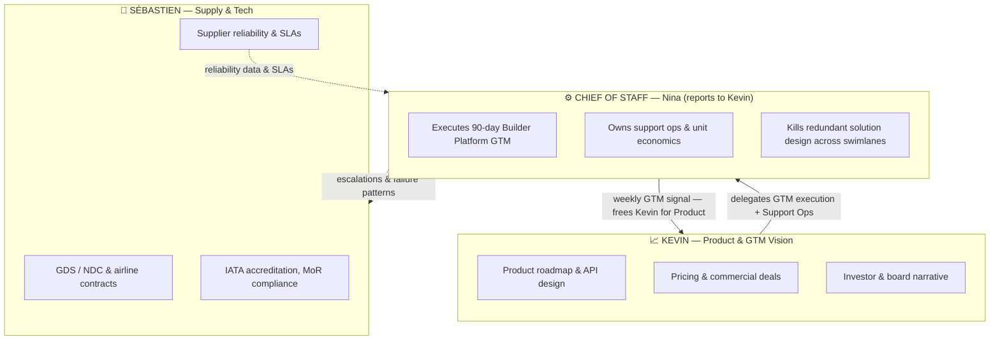
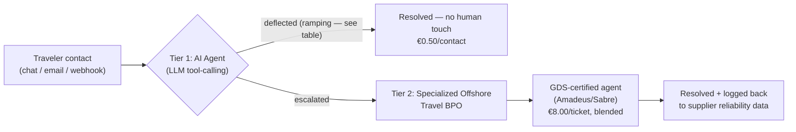

# Jinko — Chief of Staff 90-Day Plan & Support Model
**Prepared for:** Sébastien & Kevin, Co-Founders, Jinko (YC W26)
**Prepared by:** Nina Tabaka, Candidate — Chief of Staff
**Date:** September 8, 2026 · v2 — revised after founder review

> 📌 **How to read this document:** Part 0 is the operating model — how the Chief of Staff role converts founder alignment into execution capacity. Part 1 is the 90-day GTM plan I'd run starting Day 1. Part 2 is the support model that scales *alongside* Part 1: hands-on and manual for the first 50–100 bookings while I build the real playbook, then handed to a hybrid AI + BPO system once the actual failure modes are understood — not a BPO stack built in advance on guesses.

---

## Part 0: Executive Summary & Founder Alignment

**The Chief of Staff role exists to convert founder alignment into execution capacity.** Sébastien and Kevin's shared history gives Jinko a strong, aligned sense of where the business needs to go. As Jinko scales, the CoS role converts high-level founder synergy into distinct operational swimlanes, preventing context-switching — GTM execution and support ops become one dedicated swimlane, run day-to-day by the CoS, so both founders stay focused on what only they can do.

### Founder Focus vs. CoS Operational Leverage

The CoS is not a layer above the founders — it's a lateral execution engine reporting directly to Kevin, taking GTM execution and Support Ops off his plate so he can stay focused on Product. Sébastien remains a peer swimlane; the CoS exchanges supply data and escalations with him directly, without needing Kevin in the loop for every handoff.



### Strategic Alignment

> **🛡️ For Sébastien — supplier reliability is the product, not a side concern.**
> Every claim we make to Builder Platforms ("deterministic, 500ms, no captchas") is only true if supply holds. The support model in Part 2 protects this directly: escalations route supplier-caused failures (cancellations, hotel no-shows) back to you as structured data instead of anecdotes, and the sensitivity audit treats hotel margin as the single highest-impact variable in the whole model — because that's exactly where supply quality and mix show up in the P&L. You get signal, not tickets.

> **🚀 Aligning with Kevin's commercial vision — executing a sharp, concentrated bet on Builder Platforms via MCP.**
> The GTM plan spends 80% of energy on one segment and explicitly excludes Enterprise/Mid-Market RFPs, which are too slow and too founder-time-intensive for this window. The North Star Metric is a production commitment, not a vanity metric like signups or stars — it's the number that proves willingness to pay, not willingness to try.

---

## Part 1: 90-Day Go-To-Market Strategy

### Focus: Builder Platforms via MCP (80% of energy allocation)

We are not selling to individual developers. We are selling to the **platforms developers already build on** — Lovable, Replit, Vercel AI, Exa.ai (and their MCP/tool ecosystems) — so that every app built on top of them inherits Jinko as the default travel primitive. One integration, thousands of downstream apps. **Expected sales cycle: 2–4 months** per platform, from first contact to production default-integration status. The remaining 20% of energy goes to opportunistic inbound and existing pipeline maintenance — not to a second GTM motion.

### Strategic Moat: Native API vs. "Browser-Use" Failure Modes

| Failure Mode | Browser-Use Scrapers | Jinko Native API |
|---|---|---|
| **CAPTCHAs / bot walls** | Breaks the agent mid-task, unrecoverable without human intervention | Never encountered — direct API, no browser |
| **Token overhead** | 15,000–50,000+ tokens per booking flow (full DOM/screenshot context) | ~500 tokens per call — structured JSON in/out |
| **Latency** | 30–90+ seconds per flow, highly variable | <450ms, deterministic |
| **PNR / ticketing capability** | **None.** Cannot issue a real, GDS-backed PNR | Native IATA ticketing, direct GDS connections, real PNR generation |
| **Payment & liability** | No Merchant of Record — agent builder inherits chargeback/compliance risk | Jinko is MoR — liability sits with us, not the builder |
| **Reliability under UI change** | Breaks silently whenever the target site redesigns | Versioned API contract — breaking changes are opt-in |

This table *is* the pitch to a Builder Platform's DevRel/BD lead: they are currently shipping demos that cannot actually book anything real. We let them ship a feature that works.

### North Star & Secondary Metrics

> **🎯 North Star (Day 90): 1 Builder Platform live in production running Jinko as its DEFAULT travel integration, plus 1 additional platform in technical beta/trial — collectively driving >€150,000 in GMV (generating >€10,000 in net Jinko revenue).**

Two platforms fully in production by Day 90 doesn't square with a 2–4 month sales cycle that starts at Day 1 — one live, one in trial is the honest version of the same ambition. GMV and net revenue are reported separately on purpose: GMV (traveler-facing transaction value) proves real usage; net revenue (Jinko's take) is what actually funds the business — conflating the two overstates what's in the bank.

> **📊 Secondary Metric: Hotel booking mix ≥ 35% of total bookings.** Hotels carry a materially higher net take rate than flights (see Part 2), so the *composition* of the €150k GMV matters as much as the total — a GMV number driven mostly by flights converts to far less net revenue than one with a healthy hotel mix.

### 90-Day Execution Timeline

| Month | Theme | Key Actions | Exit Criteria |
|---|---|---|---|
| **Month 1** (Wk 1–4) | **Target & Landing Page** | Ship `jinko.com/mcp`. Rank the 5–8 highest-leverage Builder Platform contacts (Head of DevRel/BD at Lovable, Replit, Vercel AI, Exa.ai + 2–3 second-tier targets). Send the cold outreach sequence (Asset 1). Get 3+ discovery calls booked. | Landing page live, 3+ qualified calls booked, 1 platform agrees to a technical trial |
| **Month 2** (Wk 5–8) | **Hackathon & Bounties** | Co-host or sponsor a builder hackathon on the platform with the strongest early signal. Launch a developer bounty program (€500–2,000 per shipped, working integration) to get 5–10 real apps built on Jinko MCP outside our own team. Instrument every integration for GMV and hotel-mix tracking. | ≥5 community-built apps live on Jinko MCP, ≥1 platform commits to featuring Jinko in official docs/templates |
| **Month 3** (Wk 9–12) | **Production Deploy** | Convert the strongest platform relationship into a formal "default integration" agreement. Keep the second platform advancing through technical trial. Support the top 2–3 community apps through real production traffic. Close the North Star Metric. | 1 platform live in production + 1 platform in technical beta/trial, >€150k combined GMV (>€10k net Jinko revenue), ≥35% hotel mix |

### Anti-Goals (What We WILL NOT Do)

- **Zero direct Enterprise/Mid-Market RFPs.** Different buyer, different sales cycle (often 9–18 months), different swimlane — responding to even one RFP this window would eat founder time that belongs in Builder Platform conversations. Any inbound RFP gets a polite decline + "revisit in 2027" note, not a pursuit.
- **No integrations outside the top 5–8 ranked Month-1 targets.** Breadth kills a concentrated GTM motion.
- **No paid acquisition (ads, sponsorships beyond one hackathon) before Month 2.** Unpaid, high-intent developer channels first; paid spend only once we know what converts.
- **No per-platform API customization.** One SDK, one MCP server. Platform-specific wrappers are the platform's job, not ours.

### Pivot Triggers

| Signal (by end of…) | Trigger |
|---|---|
| Month 1 | Zero discovery calls booked after 25–30 contacts across multiple platforms → rework the offer/asset, not the target list |
| Month 1 | A DevRel/BD contact responds but flags "no developer demand for travel" → redirect outreach to a different vertical inside the same platform (e.g., internal-tools teams building corporate travel bots) before abandoning the platform |
| Month 2 | Fewer than 3 community apps shipped from the bounty program → the friction is technical, not incentive-based; pause new bounties and fix onboarding/docs first |
| Month 3 | On track for <€75k combined GMV → do not declare victory on "default integration" status alone; extend Month 3 by 30 days rather than move goalposts |
| Any month | Hotel mix trending <25% with no correction path → escalate to **both** Kevin (agent prompt/UX may be steering travelers toward flights over hotels) and Sébastien (supply-side hotel inventory/pricing) — this is a joint product-and-supply problem, not a single-owner fix |

---

### 📧 Embedded Shipped Asset 1: Cold Outreach Email

> **Target:** Head of DevRel / Head of BD at a Builder Platform (e.g., Lovable)
> **Channel:** Email (LinkedIn as backup, 48h later if no reply)
> **Goal:** Book a 20-minute technical discovery call to scope a joint MCP integration + developer bounty program
> **Signature note:** signed with a GTM-facing title, not "Chief of Staff" — a DevRel counterpart replies to a peer in developer partnerships, not a corporate title.

```
Subject: Your users' AI agents can't actually book a flight — we fixed that

Hi {{First Name}},

Quick one — I've been building demos on {{Platform}} and noticed something:
every "AI travel agent" template I've seen (yours included) either fakes the
booking step or hands off to a browser-automation scraper that breaks on
captchas and can't issue a real ticket.

We built Jinko to fix exactly that gap. It's a native travel API + MCP
server that gives any AI agent real execution — deterministic search,
booking, and payment, with actual IATA ticketing, direct GDS connections,
and real PNR generation. No browser, no captchas, no token bloat:

  - <450ms response time (vs. 30-90s for browser-use scrapers)
  - ~500 tokens per call (vs. 15-50k for DOM-based automation)
  - We're the Merchant of Record — your users' agents can transact without
    you inheriting payment/compliance liability

Two-line setup with the Vercel AI SDK / Claude Desktop / any MCP client:

  npx @jinko/mcp-server

I'd like to propose two things for {{Platform}}:
  1. A joint MCP integration — Jinko wired in as the default travel tool
     in your relevant templates, with $500 in free sandbox credit for
     your team to build and test against.
  2. A co-branded developer bounty (€500-2,000 per shipped integration)
     to seed real, working travel apps in your community — content and
     proof-of-concept for both of us, funded by us.

Worth 20 minutes this week or next to scope it out?

Best,
Nina Tabaka
GTM & Developer Partnerships, Jinko
{{calendar link}}
```

---

## Part 2: Traveler Support Model

**The constraint:** in-house, always-on European travel support is not viable on €10–15 flight commissions alone at scale — but scale isn't the Day 1 problem. The sequencing below is the actual plan: prove the failure modes by hand first, then build the system that handles them at volume.

### Phase 0: Manual Support (Bookings 1–100)

For the first 50–100 bookings, I handle support personally — every contact, every edge case, logged by hand. This isn't a stopgap; it's how the Protocol Matrix and the deflection/BPO assumptions below get validated instead of guessed. Real traveler contacts at this stage tell us which of the 4 emergency cases actually happen, how often, and what a real resolution looks like — data no vendor RFP or industry benchmark can give us before we've booked a single trip. The hybrid model in Phase 1 launches once this data exists, not before.

### Phase 1: Hybrid AI + BPO (Bookings 100+)



- **Tier 1 — AI Deflection:** Every inbound contact hits an LLM agent first, with direct tool-calling access to booking status, PNR lookup, and rebooking APIs (not a generic chatbot — it can actually take action). Deflection is **not** assumed flat from Day 0 — it ramps as the model sees more real ticket volume from Phase 0 onward: **35–40% at launch → 50% by Month 6 → 60% by Month 12.**
- **Tier 2 — Specialized Offshore Travel BPO:** Escalations route to a GDS-certified BPO (Amadeus/Sabre trained agents), priced **per resolved ticket, not per hour** — so cost scales with volume, not headcount decisions. €8.00/ticket is the blended rate for standard escalations; critical incidents carry a separate reserve (see Protocol Matrix, Scenario 2).

### Financial Capacity Table

> ⚠️ **All figures below are illustrative, invented planning variables** — see the Sensitivity Audit for what's assumed vs. tested. "Net revenue" here is Jinko's own blended take per booking (flight service fee + hotel margin, at the ≥35% hotel-mix target), assumed at **€25** — this is deliberately *not* the traveler-facing GMV used as the Part 1 North Star; the two are kept separate for the same reason the North Star Metric now reports GMV and net revenue separately.

| | **Month 0** | **Month 6** | **Month 12** |
|---|---|---|---|
| Monthly bookings | 400 | 2,000 | 4,000 |
| Jinko net revenue (bookings × €25) | €10,000 | €50,000 | €100,000 |
| Contact rate (assumed) | 15% | 15% | 15% |
| Total contacts | 60 | 300 | 600 |
| AI deflection rate (ramping) | 35% | 50% | 60% |
| Tier 1 (AI) cost @ €0.50/contact | €30 | €150 | €300 |
| Escalated to Tier 2 BPO | 39 | 150 | 240 |
| Tier 2 (BPO) cost @ €8.00/ticket | €312 | €1,200 | €1,920 |
| **Total support cost** | **€342** | **€1,350** | **€2,220** |
| **% of net revenue** | **3.4%** | **2.7%** | **2.2%** |

This is the honest version of the model: support cost starts **above** the 2.5% long-run target while the AI is still learning (Month 0, subsidized in practice by Phase 0's manual groundwork) and **converges below it by Month 12** as deflection improves with real volume — not a flat ratio assumed from day one. Critical-incident costs (Protocol Matrix Scenario 2) are budgeted separately via a monthly emergency reserve and are not included in the €8.00 blended BPO rate above.

### Explicit Invented Variables & Sensitivity Audit

| Variable | Assumed Value | Stress Test | Impact | Notes |
|---|---|---|---|---|
| **Contact rate** | 15% | Tested at 30% | 🟢 **Low impact** — unit economics remain structurally sound | Doubling the contact rate to 30% doubles total support cost at every volume stage — at Month 12, the ratio moves from **2.2% → 4.4%** of net revenue. Still well below the booking margin it protects — the business remains profitable even in this stress case. |
| **Hotel net margin** | €35.00/hotel booking | Sensitivity run at 20–35% mix | 🔴 **High impact** — margin health relies on keeping hotel mix ≥ 30% | Hotel margin is the single largest lever in blended net revenue per booking, and therefore the single biggest driver of the support-cost ratio. Below ~30% hotel mix, the ratio crosses the 2.5% long-run target even at Month 12 deflection. This is why the GTM secondary metric targets ≥35% mix — a 5-point buffer above the danger floor. |
| **BPO ticket cost** | €8.00/ticket | Tested at €15.00 | 🟡 **Medium impact** | At Month 12 volume, €15/ticket raises Tier 2 cost to €3,600 (total €3,900, ~3.9% of net revenue) — well above target. Mitigation: lock a multi-year BPO contract with volume-based rate step-downs before Month 6, and treat AI deflection gains as additional insurance against this exposure. |
| **AI deflection cost** | €0.50/contact | Tested at €5.00 (10x) | 🟢 **Low impact** | Even at 10x this cost, Tier 1 spend at Month 12 volume is only €3,000 — structurally small relative to Tier 2 BPO cost. Not a variable worth over-optimizing early. |
| **Look-to-book efficiency limit** | 150:1 (searches per completed booking) | — | ⚙️ **Infrastructure cost cap, solved with UX in mind** | Bounds Jinko's own GDS/search API cost exposure. Rather than rate-limiting agents that search aggressively past 150:1 (which degrades the builder's developer experience mid-integration), the mitigation is a **caching layer** on high-frequency search patterns — absorbing aggressive look-to-book ratios without throttling anyone. Flagged here because it's a Month 2–3 GTM onboarding item, not just a finance assumption. |

### Protocol Matrix — 4 Emergency Cases

| # | Scenario | Response Protocol | Tier | SLA |
|---|---|---|---|---|
| **1** | *"Never got my booking reference"* | 100% automated — Tier 1 AI webhook fetches the PNR via traveler email lookup and resends the confirmation instantly. No human touch. | Tier 1 (AI) | < 2 minutes |
| **2** | *"11pm, hotel says they have no booking for me"* | Priority routing bypasses AI triage — Tier 2 BPO calls the hotel desk directly; pushes a secondary payment to resolve on the spot, or rehouses the guest using a pre-authorized emergency rehousing budget, reconciling with the original supplier next business day. Costs more than a standard ticket — budgeted at **€20–€25 per critical incident** via a monthly emergency reserve, not the blended €8.00 BPO rate. | Tier 2 (BPO), priority queue | < 3 min acknowledgment · < 45 min resolution |
| **3** | *"Name typo on ticket, 18 hours to flight"* | Routed to a GDS-certified BPO agent who processes the correction according to the specific airline's waiver policy — not a blanket "correct it in Amadeus/Sabre," since eligibility and fees vary by carrier and fare class. | Tier 2 (BPO), GDS-certified only | < 4 hours (well inside the 18h window, buffered for airline processing) |
| **4** | *"Flight cancelled by the airline"* | Tier 2 BPO executes automated rebooking under the operating airline's waiver policy — identifying eligible alternate flights and rebooking via API where the airline supports it, falling back to manual GDS intervention only when the waiver is ambiguous or requires it. | Tier 2 (BPO), automated-first | < 3 min acknowledgment · < 45 min resolution |

---

## Summary: What This Delivers by Day 90

1. **One Builder Platform live in production, one in technical beta/trial**, Jinko as default integration on the first, >€150k combined GMV generating >€10k net Jinko revenue, at ≥35% hotel mix — proof of willingness to pay, not just willingness to try, with a revenue composition that funds the business, not just the top line.
2. **A support model proven by hand before it's automated** — Phase 0 builds the real playbook on the first 50–100 bookings; Phase 1's hybrid AI + BPO cost converges to under 2.5% of net revenue by Month 12 as deflection ramps with real data, not an assumption made on Day 0.
3. **Founders in their lanes** — Kevin delegates GTM execution and support ops to a CoS who reports directly to him, freeing Product bandwidth; Sébastien gets structured escalation data instead of ad hoc fire drills, and joint ownership (with Kevin) of any signal that traces back to product/UX rather than supply.
